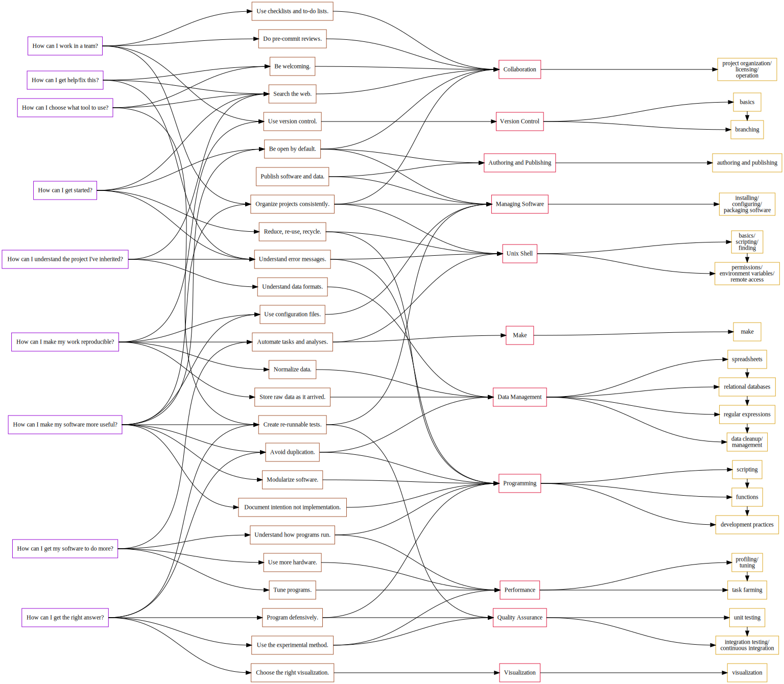

This course is an introduction to research computing and data analysis
for people with little or no previous training in either.
It can be used either as the core of a one-semester course for graduate or undergraduate students,
or for self-study by people who plan to enroll in a program like
the [Insight Data Science][insight] Fellows Program.
The course and related software freely available under [an open licence](./license/),
and can be viewed on [the course's website][site].

Questions, suggestions, and corrections are very welcome:
please [file an issue][issues]
in the course's [GitHub repository][repo]
or [email the author directly][email].
Please note that all contributors are required to abide by
[our code of conduct](./conduct/).

This course is inspired by:

- [Software Carpentry][swc], [Data Carpentry][dc], and [Library Carpentry][lc]
- [Data Carpentry for Biologists][dcb]
- "[Best Practices for Scientific Computing][best]"
- "[Good Enough Practices in Scientific Computing][good]"
- "[Ten Simple Rules for Making Research Software More Robust][robust]"
- [Managing Research Software Projects][mrsp]

Please see the course design notes below for an overview of current thinking,

----

## Design

This design template is taken from *[Teaching Tech Together][t3]*.
The first section explains who this course is for,
while the second sketches its scope.
Sections 3 and 4 then lay out what learners will do in what order,
and the final section is the course's public face.

This course's primary tools are Google Sheets, Unix, Python, and the Jupyter Notebook.
Parallel material using Excel, Windows, R, and RStudio will be designed separately.

<!-- -------------------------------------------------------------------------------- -->

### Step 1: Who is this course for?

#### Bhadra

Bhadra received a B.Sc. in biochemistry five years ago, and has worked
since then for a small biotech firm.  She did a biostatistics course
using R as a senior, but has no other training in programming.

Bhadra is developing pattern-matching algorithms for gene expression.
Every morning, Bhadra manually runs any queries her colleagues have
emailed her and emails the results back.  Once a month she manually
re-analyzes the input and output files she has saved to look for new
patterns.

This course will teach Bhadra how to automate her daily and monthly
tasks, how to write regression tests for her software so that
additions and changes don't break existing features, and how to
package her software so that her colleagues can install it and run it
themselves.

#### Jorge

Jorge just moved from Costa Rica to Canada to study agricultural
economics.  Other than using Excel, Word, and the Internet, Jorge's
most significant previous experience with computers is helping his
sister build a WordPress site for the family business back home in
Costa Rica.

Jorge needs to find, clean, integrate, and analyze data from land use
registries, labor statistics, commodity prices, and weather records.
He has inherited a handful of spreadsheets and programs written by
previous members of his lab to handle each of these separately, but
does not know whether he has the most up-to-date version of each, or
even precisely what kind of filtering and analysis each does.

This course will teach Jorge how to manage the code and data used in a
small research software project, how to fetch and process text, CSV,
and JSON data, how to write basic SQL queries to get data from
databases, and how to create simple exploratory visualizations.

#### Mei

Mei is a graduate student in chemistry. Her only programming
experience is a general first-year introduction to computational
science using Python.

Mei is studying the carcinogenic effects of fullerenes. A typical
experiment involves testing each sample on four hundred slightly
different gels.  Using a machine borrowed from a collaborating lab,
she can prepare all the gels at once, but must manually edit and
upload a parameter file to the machine to do this.  She must then
download the results, add them to the steadily-growing archive, and
re-analyze the data.  The archive is now half a terabyte in size,
and analysis takes roughly 14 hours on a high-end desktop computer.

Over time, Mei has become more interested in the statistics she is
doing than in the underlying chemistry, and has decided that once she
completes her PhD, she would like to become a data scientist.  This
course will introduce her to tools and methods that will help her
finish her degree faster, and prepare her to work with much larger
data using more complicated statistical methods.

<!-- -------------------------------------------------------------------------------- -->

### Step 2: Brainstorming

1. What questions will this course answer?
   1. How should I organize a research software project?
   1. How should I manage my data, code, and reports?
   1. How can I build more software in less time and with less effort?
   1. How can I tell if my software is working correctly?
   1. How can I visualize my work?
   1. How can I get and use other people's data?
   1. How can I make my work more reproducible?
   1. How can I publish my work in less time and with less effort?
   1. How can I use other people's software and make it easy for people to use mine?
   1. How can I keep track of what I've done and what I still need to do?
   1. How can I make my programs faster?
   1. How can I use clusters, the cloud, and other hardware?
1. What concepts and techniques will students learn?
   1. Organize and manipulate tabular data in a spreadsheet.
   1. Manage and process files with the Unix shell.
   1. Process tabular data in Python.
   1. Do iterative development.
   1. Embed documentation (docstrings).
   1. Name and organize the files in a project systematically.
   1. Track work with Git.
   1. Make work reproducible using Make.
   1. Test Python programs with Pytest.
   1. Install and create packages with Pip.
   1. Do numerical computing with NumPy.
   1. Visualize data with Altair.
   1. Process text with regular expressions.
   1. Write queries in SQL.
   1. Do statistics with Pandas.
   1. Get data using HTTP and REST APIs (or by scraping if need be).
   1. Connect to remote computers using SSH.
   1. Do large-scale computing in the cloud.
   1. Share work using GitHub and Travis.
   1. Create and publish a static website using Jekyll.
1. What technologies, packages, or functions will students use?
   1. Spreadsheets: same topics as the [Data Carpentry lesson][dc-sheets] using Google Sheets.
   1. Unix shell: same topics as the [Software Carpentry lesson][swc-shell], with some [extra material][swc-shell-extra] on permissions.
   1. Python, NumPy, and Pandas: same topics as the [revised Software Carpentry lesson][swc-python], with extra material on writing command-line utilities.
   1. Pytest: new material.
   1. Jupyter Notebook: introduced *after* learners are comfortable processing tabular data in Python.
   1. Git and GitHub: same topics as the [Software Carpentry lesson][swc-git] (split into separate lessons on tracking and collaborating).
   1. SQL: same topics as the [Software Carpentry lesson][swc-sql].
   1. SSH: topics taken from [Software Carpentry's extras][swc-shell-extra].
   1. Project organization: topics taken from [Managing Research Software Projects][mrsp] and [Noble's rules][noble].
   1. Packaging: new material (using Pip rather than Conda for simplicity).
   1. Working with remote data: new material on HTTP and the Python `requests` library (depends on understanding dictionaries to use JSON).
   1. Publishing: new material on Markdown and Jekyll (rather than LaTeX).
   1. Altair: new material.
   1. Cloud computing: new material based on [HPC Novice][hpc-novice].
1. What concepts will be introduced?
   1. Tidy data.
   1. Associative data (dictionaries, databases).
   1. Pipe and filter model.
   1. Version control repository.
   1. Embedded documentation for software.
   1. Relational data.
   1. Program decomposition and iterative development.
   1. Commit (both version control and databases).
   1. Pull request.
   1. Unit testing.
   1. Continuous integration.
   1. Task automation and workflow.
   1. Declarative computing (for database queries and visualization).
   1. Primary and foreign keys.
   1. Public/private keys.
   1. Data decomposition (for high-throughput computing).
   1. Text processing for publication (rather than WYSIWYG).
1. What misconceptions are expected?
   1. Why would I use the shell instead of Python? (duplication of utility between tools)
   1. How come I can't open my data files? (Path issues when using GUI tools)
   1. What the hell is a "detached HEAD"? (and other Git weirdness)
   1. What are all these curly braces for? (indexing by name in dictionaries, JSON, etc.)
   1. How can two different variables have the same name? (variable scope)
   1. Why did parallelizing my work make it slower? (I/O-bound computation)
   1. Why can't I install this software/log in to this computer? (permissions)

Please click on the diagram below for a visualization of how learners' questions and our answers
feed into lessons and topics in this course.

<!-- -------------------------------------------------------------------------------- -->

### Step 3: What will the student do along the way?

- Generate CSV index of photo archive
  - Variable scope
  - Libraries
  - Lists
  - Functions
  - File I/O
- Scrape data from several sites and store in a database
  - HTTP requests
  - Regular expressions
  - SQL
- FIXME: more to come

<!-- -------------------------------------------------------------------------------- -->

### Step 4: How are the concepts connected?

FIXME: lesson-by-lesson outline.

<!-- -------------------------------------------------------------------------------- -->

### Step 5: Course overview

#### Course Description

This course is an introduction to research computing and data analysis
for people with little or no previous training in either.
It can be used either as the core of a one-semester for graduate or undergraduate course,
or for self-study by people who are thinking about becoming data scientists
and want a solid base to build on.

#### Prerequisites

Learners will need:

- A personal computer with Internet access.
- The Bash shell.
- Python 3 (including the Jupyter Notebook).
- Google and GitHub accounts.

#### Other Resources

- [Software Carpentry][swc]
- [Data Carpentry][dc]
- [Data Carpentry for Biologists][dcb]
- [Learn the tidyverse][tidyverse]
- "[Best Practices for Scientific Computing][best]"
- "[Good Enough Practices in Scientific Computing][good]"
- "[Ten Simple Rules for Making Research Software More Robust][robust]"
- [Managing Research Software Projects][mrsp]

[best]: http://journals.plos.org/plosbiology/article?id=10.1371/journal.pbio.1001745
[dc-sheets]: https://datacarpentry.org/spreadsheet-ecology-lesson/
[dc]: http://datacarpentry.org
[dcb]: https://datacarpentry.org/semester-biology/
[email]: mailto:gvwilson@third-bit.com?subject=Merely%20Useful
[good]: http://journals.plos.org/ploscompbiol/article?id=10.1371/journal.pcbi.1005510
[hpc-novice]: https://christinalk.github.io/hpc-novice-1/
[insight]: https://www.insightdatascience.com/
[issues]: https://github.com/gvwilson/merely-useful/issues
[lc]: https://librarycarpentry.org/
[mrsp]: https://swcarpentry.github.io/managing-research-software-projects/
[noble]: http://journals.plos.org/ploscompbiol/article?id=10.1371/journal.pcbi.1000424
[repo]: https://github.com/gvwilson/merely-useful/
[robust]: http://journals.plos.org/ploscompbiol/article?id=10.1371/journal.pcbi.1005412
[site]: https://gvwilson.github.io/merely-useful/
[swc-git]: http://swcarpentry.github.io/git-novice/
[swc-python]: http://swcarpentry.github.io/python-novice-gapminder/
[swc-shell-extra]: http://swcarpentry.github.io/shell-extras/
[swc-shell]: http://swcarpentry.github.io/shell-novice/
[swc-sql]: http://swcarpentry.github.io/sql-novice-survey/
[swc]: https://software-carpentry.org/
[t3]: http://teachtogether.tech
[tidyverse]: https://www.tidyverse.org/learn/
