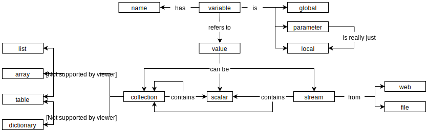

This course is an introduction to research computing and data analysis
for people with little or no previous training in either.
It can be used either as the core of a one-semester course for graduate students or senior undergraduates,
or for self-study by people who plan to enroll in a program like
the [Insight Data Science][insight] Fellows Program.
The course and related software freely available under [an open licence](./license/),
and can be viewed on [the course's website][site].

This course assumes 30 contact hours
(i.e., 3 hours/week for 12 weeks minus time for guest speakers, exam prep, and so on).
The pace is based on what [Software Carpentry][swc] and [Data Carpentry][dc] routinely achieve in their two-day workshops,
and on the University of Florida's experience with [Data Carpentry for Biologists][dcb].

Questions, suggestions, and corrections are very welcome:
please [file an issue][issues]
in the course's [GitHub repository][repo]
or [email the author directly][email].
Please note that all contributors are required to abide by
[our code of conduct](./conduct/).

This course is inspired by:

- [Software Carpentry][swc], [Data Carpentry][dc], and [Library Carpentry][lc]
- [Data Carpentry for Biologists][dcb]
- "[Best Practices for Scientific Computing][best]"
- "[Good Enough Practices in Scientific Computing][good]"
- "[Ten Simple Rules for Making Research Software More Robust][robust]"
- [Managing Research Software Projects][mrsp]

Please see the course design notes below for an overview of current thinking,

----

## Design

This design template is taken from *[Teaching Tech Together][t3]*.
The first section explains who this course is for,
while the second sketches its scope.
Sections 3 and 4 then lay out what learners will do in what order,
and the final section is the course's public face.

This course's primary tools are Google Sheets, Unix, Python, and the Jupyter Notebook.
Parallel material using Excel, Windows, R, and RStudio will be designed separately.

<!-- -------------------------------------------------------------------------------- -->

## Step 1: Who is this course for?

### Bhadra

Bhadra received a B.Sc. in biochemistry five years ago, and has worked
since then for a small biotech firm.  She did a biostatistics course
using R as a senior, but has no other training in programming.

Bhadra is developing pattern-matching algorithms for gene expression.
Every morning, Bhadra manually runs any queries her colleagues have
emailed her and emails the results back.  Once a month she manually
re-analyzes the input and output files she has saved to look for new
patterns.

This course will teach Bhadra how to automate her daily and monthly
tasks, how to write regression tests for her software so that
additions and changes don't break existing features, and how to
package her software so that her colleagues can install it and run it
themselves.

### Jorge

Jorge just moved from Costa Rica to Canada to study agricultural
economics.  Other than using Excel, Word, and the Internet, Jorge's
most significant previous experience with computers is helping his
sister build a WordPress site for the family business back home in
Costa Rica.

Jorge needs to find, clean, integrate, and analyze data from land use
registries, labor statistics, commodity prices, and weather records.
He has inherited a handful of spreadsheets and programs written by
previous members of his lab to handle each of these separately, but
does not know whether he has the most up-to-date version of each, or
even precisely what kind of filtering and analysis each does.

This course will teach Jorge how to manage the code and data used in a
small research software project, how to fetch and process text, CSV,
and JSON data, how to write basic SQL queries to get data from
databases, and how to create simple exploratory visualizations.

### Mei

Mei is a graduate student in chemistry. Her only programming
experience is a general first-year introduction to computational
science using Python.

Mei is studying the carcinogenic effects of fullerenes. A typical
experiment involves testing each sample on four hundred slightly
different gels.  Using a machine borrowed from a collaborating lab,
she can prepare all the gels at once, but must manually edit and
upload a parameter file to the machine to do this.  She must then
download the results, add them to the steadily-growing archive, and
re-analyze the data.  The archive is now half a terabyte in size,
and analysis takes roughly 14 hours on a high-end desktop computer.

Over time, Mei has become more interested in the statistics she is
doing than in the underlying chemistry, and has decided that once she
completes her PhD, she would like to become a data scientist.  This
course will introduce her to tools and methods that will help her
finish her degree faster, and prepare her to work with much larger
data using more complicated statistical methods.

<!-- -------------------------------------------------------------------------------- -->

## Step 2: Brainstorming

1. What questions will this course answer?
   1. How can I manage data, code, and reports?
   1. How can I build software faster?
   1. How can I tell if my software is correct?
   1. How can I make my work reproducible?
   1. How can I share data and software with others?
1. What concepts and techniques will learners meet?
   1. Organize and manipulate tabular data in a spreadsheet.
   1. Manage and process files with the Unix shell.
   1. Process tabular data in Python.
   1. Program iteratively and defensively.
   1. Embed documentation in code.
   1. Name and organize the files in a project systematically.
   1. Track work with Git using a branching workflow.
   1. Share work with GitHub using pull requests.
   1. Make work reproducible using Make.
   1. Write tests with PyTest.
   1. Install packages with Pip.
   1. Do numerical computing with NumPy.
   1. Do statistics with Pandas.
   1. Visualize data with Altair.
   1. Process text with regular expressions.
   1. Write queries in SQL.
   1. Fetch remote data using Requests.
   1. Create and publish a static website using GitHub.
   1. Use ORCIDs and DOIs to identify authors, reports, and data.
1. What technologies, packages, or functions will learners use?
   1. Spreadsheets: same topics as the [Data Carpentry lesson][dc-sheets] using Google Sheets.
   1. Unix shell: same topics as the [Software Carpentry lesson][swc-shell], with some [extra material][swc-shell-extra] on permissions.
   1. Python, NumPy, and Pandas: same topics as the [revised Software Carpentry lesson][swc-python], with extra material on writing command-line utilities.
   1. Pytest: new material.
   1. Jupyter Notebook: introduced *after* learners are comfortable processing tabular data in Python.
   1. Git and GitHub: same topics as the [Software Carpentry lesson][swc-git] (split into separate lessons on tracking and collaborating).
   1. SQL: same topics as the [Software Carpentry lesson][swc-sql].
   1. Project organization: topics taken from [Managing Research Software Projects][mrsp] and [Noble's rules][noble].
   1. Packaging: new material (using Pip rather than Conda for simplicity).
   1. Working with remote data: new material on the Python `requests` library.
   1. Publishing: new material on [Markdown][markdown] and [GitHub Pages][github-pages].
   1. Altair: new material.
1. What concepts will be introduced?
   1. Tidy data.
   1. Pipe and filter model.
   1. Version control repository.
   1. Embedded documentation for software.
   1. Key/value data.
   1. Program decomposition and iterative development.
   1. Vectorized (whole-array) operations.
   1. Commit.
   1. Merge and merge conflict.
   1. Pull request.
   1. Unit testing.
   1. Continuous integration.
   1. Task automation.
   1. Primary and foreign keys.
   1. Publication via text processing (rather than by using WYSIWYG tools).
1. What misconceptions are expected?
   1. Why would I use the shell instead of Python? (duplication of utility between tools)
   1. How come I can't open my data files? (Path issues when using GUI tools)
   1. What the hell is a "detached HEAD"? (and other Git weirdness)
   1. What are all these curly braces for? (indexing by name in dictionaries, JSON, etc.)
   1. How can two different variables have the same name? (variable scope)
   1. Why did parallelizing my work make it slower? (I/O-bound computation)
   1. Why can't I install this software/log in to this computer? (permissions)
1. What *won't* be covered?
   1. Connecting to remote computers using SSH: no time.
   1. Parallelizing map-reduce problem using GNU Parallel: too advanced.
   1. Serving data: it would be cool to show learners how to build data services, but all we can do in a short lesson is show them how to create security holes.
   1. Writing classes: we want to encourage a mostly-functional style of programming, and there isn't time to cover both higher-order functions and writing classes.
   1. LaTeX: [Markdown][markdown] plus [Pelican][pelican] are much simpler, and let us teach the same concepts (compiled, reproducible documents).
      - We use [Pelican][pelican] rather than [Jekyll][jekyll] because it's Python-based (we can build into `./docs` for publication).
      - And because it parallels the R course using [R Markdown][r-markdown].
   1. Conditionals and functions in the shell: learners will use Python for anything that complex.
   1. Docker: too advanced for the intended audience.
   1. GIS: not universally applicable.
   1. Image processing: ditto.
   1. Non-relational databases: there (still) isn't a clear leader, and relational databases allow us to introduce the key concepts.
   1. Interactive web pages (except the interactivity provided by Altair): there isn't time to teach JavaScript.
   1. Numerical or statistical methods: lots of high-quality courses already cover these topics.
   1. High-performance computing: high throughput is more widely useful.
   1. Symbolic debuggers: unless the course uses a Python IDE.

<!-- -------------------------------------------------------------------------------- -->

## Step 3: What mental models will learners form?

<figure>
  <figcaption>Variables and Values</figcaption>
  
</figure>

<figure>
  <figcaption>Programs</figcaption>
  
</figure>

<!-- -------------------------------------------------------------------------------- -->

## Step 4: What will learners do along the way?

1. Reorganize a messy spreadsheet full of field data.
1. Debug a stripped-down version of [`cvscut`][csvcut].
1. Iteratively build a Python tool to identify duplicate datasets.
1. Reorganize a small project to be consistent with [Noble's Rules][noble].
1. Package that project's scripts using Pip.
1. Clean up a set of inconsistently-formatted text data files using regular expressions.
1. Generate a CSV index of a photo archive.
1. Fetch data from a website using a REST API.
1. Create and merge pull requests that have merge conflicts.
1. Extend a Makefile to download data, merge it into existing data, and regenerate reports.
1. Write a program to pass a set of pre-written tests.
1. Publish a single-page website for a project on GitHub.

<!-- -------------------------------------------------------------------------------- -->

## Step 5: How are the concepts connected?

FIXME: lesson-by-lesson outline.

<!-- -------------------------------------------------------------------------------- -->

## Step 6: Course overview

### Course Description

This course is an introduction to research computing and data analysis
for people with little or no previous training in either.
It can be used either as the core of a one-semester for graduate or undergraduate course,
or for self-study by people who are thinking about becoming data scientists
and want a solid base to build on.

### Prerequisites

Learners will need:

- A personal computer with Internet access.
- The Bash shell.
- Python 3 (including the Jupyter Notebook).
- Google and GitHub accounts.

### Other Resources

- [Software Carpentry][swc]
- [Data Carpentry][dc]
- [Data Carpentry for Biologists][dcb]
- [Learn the tidyverse][tidyverse]
- "[Best Practices for Scientific Computing][best]"
- "[Good Enough Practices in Scientific Computing][good]"
- "[Ten Simple Rules for Making Research Software More Robust][robust]"
- [Managing Research Software Projects][mrsp]


